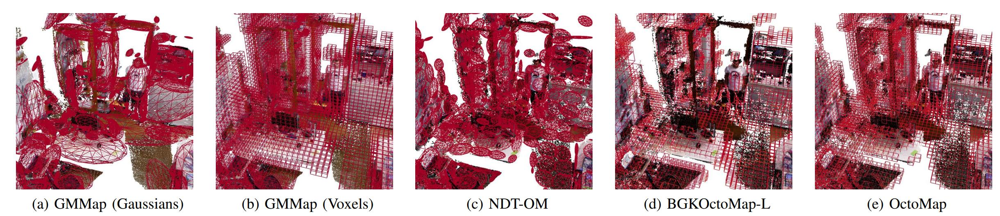
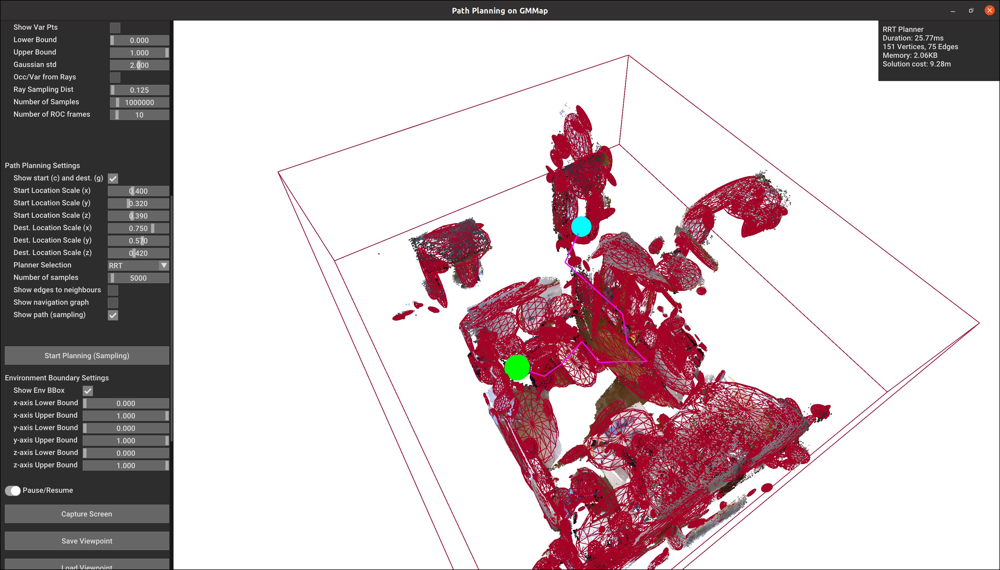

# GMMap: Memory-Efficient Continuous Occupancy Map Using Gaussian Mixture Model #

## Overview
Energy consumption of memory accesses dominates the compute energy in energy-constrained robots which require a compact 3D map of the environment to achieve autonomy. Recent mapping frameworks only focused on reducing the map size while incurring significant memory usage during map construction due to multi-pass processing of each depth image. In this work, we present a memory-efficient continuous occupancy map, named GMMap, that accurately models the 3D environment using a Gaussian Mixture Model (GMM). Memory-efficient GMMap construction is enabled by the single-pass compression of depth images into local GMMs which are directly fused together into a globally-consistent map. By extending Gaussian Mixture Regression to model unexplored regions, occupancy probability is directly computed from Gaussians. Using a low-power ARM Cortex A57 CPU, GMMap can be constructed in real-time at up to 60 images per second. Compared with prior works, GMMap maintains high accuracy while reducing the map size by at least 56%, memory overhead by at least 88%, DRAM access by at least 78%, and energy consumption by at least 69%. Thus, GMMap enables real-time 3D mapping on energy-constrained robots.

## Publication \& Presentation
You can find our Transactions on Robotics (T-RO) paper on IEEE [here](https://ieeexplore.ieee.org/document/10379145) and arXiv [here](https://arxiv.org/pdf/2306.03740.pdf).

Our presentation can be found [here](https://youtu.be/Xj-GhAt_l5U).

The figure below visualizes a room environment overlaid with the following mapping frameworks: (a) GMMap (occupied Gaussians), (b) GMMap (occupied voxels from uniform voxel-grid sampling), (c) NDT-OM (occupied Gaussians), (d) BGKOctoMap-L (occupied voxels), and (e) OctoMap (occupied voxels). For both GMMap and NDT-OM, the surface boundaries of the obstacles are smooth and often extend beyond their ellipsoidal wireframes (e.g., compare (a) and (b) for GMMap).


If you find our work useful, please cite it as follows:

```angular2html
@ARTICLE{GMMap,
  author={Li, Peter Zhi Xuan and Karaman, Sertac and Sze, Vivienne},
  journal={IEEE Transactions on Robotics}, 
  title={GMMap: Memory-Efficient Continuous Occupancy Map Using Gaussian Mixture Model}, 
  year={2024},
  volume={40},
  number={},
  pages={1339-1355},
  keywords={Memory management;Robot sensing systems;Robots;Three-dimensional displays;Random access memory;Image coding;Computational modeling;Mapping;memory efficiency;RGB-D perception;sensor fusion},
  doi={10.1109/TRO.2023.3348305}}
```

## Barebone Deployment (Mapping Only)
To build the library without any visualization and dataset capabilities, install `eigen` and `fmt` from source a package manager.

When building the library to use the CPU only, we do the following
```angular2html
cd gmm_mapping
mkdir build
cd build
cmake -DGMMAP_BUILD_CUDA=OFF -DGMMAP_BUILD_EXAMPLES=OFF ..
make
```

If GPU (CUDA) acceleration is required, we do the following
```
mkdir build
cd build
cmake -DGMMAP_BUILD_CUDA=ON -DGMMAP_BUILD_EXAMPLES=OFF ..
make
```

This should create a static mapping library for you to link your project (if you have your own custom visualizer and dataset loader).

## Dependencies (Mapping & Visualization)
Please install the following dependencies:
1. Compile [Open3D](https://github.com/isl-org/Open3D) from source.
      ```
      git clone https://github.com/isl-org/Open3D
      cd Open3D
      mkdir build
      cd build
      cmake -DGLIBCXX_USE_CXX11_ABI=ON ..
      sudo make install -j$(nproc)
      ```

    - Note: Open3D's C++ APIs can change and are not guaranteed to be backward compatible. If you install a newer version of Open3D, you might need to modify the code presented in this repository!
    - Since 3rd party libraries are installed during Open3D compilation process, we need ```sudo make``` in order to ensure that all libraries can be linked appropriately.
    - When building with Apple Silicon, ensure that ```python``` executable exists (or properly linked)!
    - If you need CUDA accelerated visualization, build with flag ```-DBUILD_CUDA_MODULE=ON``` instead.
    - On Apple Silicon, install OpenMP via brew and build Open3D with the following options:
      ```angular2html
      cmake -DGLIBCXX_USE_CXX11_ABI=ON -DWITH_OPENMP=ON -DBUILD_PYTHON_MODULE=OFF \
      -DOpenMP_C_FLAGS=-fopenmp \
      -DOpenMP_CXX_FLAGS=-fopenmp \
      -DOpenMP_C_LIB_NAMES="libomp" \
      -DOpenMP_CXX_LIB_NAMES="libomp" \
      -DOpenMP_libomp_LIBRARY="/opt/homebrew/opt/libomp/lib/libomp.dylib" \
      -DOpenMP_CXX_FLAGS="-Xpreprocessor -fopenmp -I/opt/homebrew/opt/libomp/include" \
      -DOpenMP_CXX_LIB_NAMES="libomp" \
      -DOpenMP_C_FLAGS="-Xpreprocessor -fopenmp -I/opt/homebrew/opt/libomp/include" ..
      ```

2. Install additional dependencies (from source or a package manager): ```eigen, jsoncpp```.
3. Install additional dependences (from source to get the latest version): ```fmt, tabulate```.

### Additional notes for users with Apple Silicon
1. Do not install ```fmt``` before ```Open3D```
2. Install ```gcc``` via ```brew```. Then, change the ```LIBS_OPT``` variable in [CMakeLists.txt](CMakeLists.txt) to ensure that the library ```libguadmath.a``` is correctly located.
3. To ensure that OpenMP is supported, install ```llvm``` via ```brew``` and use its ```clang``` to compile this library (i.e., Do not use ```clang``` from XCode).

## Build Instruction (Mapping & Visualization)
First, clone the repository as follows:
```
git clone https://github.com/mit-lean/GMMap.git
```

When building the library to use the CPU only, we do the following
```
cd gmm_mapping
mkdir build
cd build
cmake -DGMMAP_BUILD_CUDA=OFF -DGMMAP_BUILD_EXAMPLES=ON ..
make
```

If GPU (CUDA) acceleration is required, we do the following
```
mkdir build
cd build
cmake -DGMMAP_BUILD_CUDA=ON -DGMMAP_BUILD_EXAMPLES=ON ..
make
```

## Adopting GMMap to Your Applications
All the GMMap parameters are read from a `.json` file. Examples of such files are located in the [indoor](example/indoor) and [outdoor](example/outdoor) directory. Please refer to the instructions [here](example/README.md) for tips and explanations of each parameter. We also provide several examples in the following section to assist you.

## Example Applications
Firstly, make sure to change the location of the dataset in the `dataset_path::location` of the `*.json` file within the [indoor](example/indoor) and [outdoor](example/outdoor) directory. Note that this location is defined relative to the `$HOME` directory of your OS. All other directories are defined relative to the current directory with the executable. Please refer to our [dataset utility](libs/dataset_utils) for how the dataset is loaded. For your convenience, we included some sequences from TUM and Tartanair that you can download [here](https://drive.google.com/file/d/1XcQ0FIZHh2XLnf31aUwRBR76-0EBK0FU/view?usp=sharing).

### Map Visualization
When mapping using CPU only, we run the visualization example for the Room sequence in the TUM dataset as follows:
```
./GMMMapVisualization tum ../example/indoor 0 3000 0 --device CPU:0
```

When mapping with CPU and GPU, we run the visualization example for the same sequence as follows:
```
./GMMMapCudaVisualization tum ../example/indoor 0 3000 --device CPU:0
```

To learn more about the functionalities of the command-line arguements, read the source code in the [example](example) folder. In addition, feel free to checkout the GUI options. **Depending on your hardware, interacting with GUI too rapidly may cause it to crash. Thus, we recommend the following for large environment**

1. Do not drag the sliders. Just click at the desired location.
2. The visualizer and GMMap construction are occuring on separate threads. Since the throughput of GMMap is very high, the visualizer is not able to keep up with the geometry updates and can crash. To prevent this, we provide `Update Interval` and `Visualization Latency` slider in the `Reconstruction Settings` panel. Updated geometries of the constructed map will be transferred to the visualizer in batches at a certain frame interval defined by the `Update Interval` slider. In addition, a small latency in ms is defined in `Visualization Latency` and is added after each image to slow down the GMMap construction. Feel free to play with these settings so that the visualizer run successfully on your hardware.
3. **The throughput statistics displayed in the upper right-hand panel can be lower than expected** because the visualizer "steals" significant CPU resources from map construction. Please run GMMap in headless mode instead!

### Headless Mode
To accurately obtain the throughput of the algorithm, please run the mapping algorithm without the GUI in headless mode. 

When using the CPU only, we run the headless example for the Room sequence in the TUM dataset as follows:
```
./GMMMapNoViz tum ../example/indoor 0 3000
```
You should expect to see some statistics summarizing the throughput and map size in the terminal, such as 
```
Obstacle clusters: 1021
Free clusters: 273
Total cluster size: 111.20KB
Rtree size: 61.45KB,
Total Rtree nodes: 1573
GMM Clustering FPS: 470.336
GMM Fusion FPS: 2209.384
GMM Mapping FPS: 387.784
Map Size: 172.65KB
```

When mapping with CPU and GPU, we run the headless example for the same sequence as follows:
```
./GMMMapCudaNoViz tum ../example/indoor 0 3000
```

### Path Planning
We also provide an example on how to use GMMap in a path planning scenario for the TUM Room sequence. In particular, we i) generate a map and then save it, ii) load the saved map, iii) choose start and goal location, and iv) perform RRT to get a feasible path connecting start and goal location. We explain how to do each step as follows:
1. **Generating & saving a map**: Compile the CPU visualization example and execute it via `./GMMMapVisualization tum ../example/indoor 0 3000 0 --device CPU:0`. Make sure that the `Save Map` box is checked in the GUI. At the end of the execution, a GMMap in binary format and point cloud of the environment will be saved in a subdirectory of the `result_path` defined in the `.json` parameter file.

2. **Load a saved map**: Compile the `GMMPathPlanningViz` executable, and execute it as `./GMMPathPlanningViz tum ../path_planning_example/indoor gmmap.bin pointcloud.pcd --device CPU:0`. Then, toggle the `Pause/Resume` button to load the GMMap and the point cloud from the previously saved location. If the default `result_path` is changed, make sure to update the `*.json` file in the [path_planning_example](path_planning_example) directory.

3. **Choose start & goal location**: At this point, you should see the entire map, its point cloud, and two spheres. The blue sphere is the start location, and the green sphere is the goal location. You can use the `Path Planning Settings` panel of the GUI to change the location of these spheres relative the bounding box that encloses the entire environment. Note that the start and goal location has to be obstacle-free to be valid for path planning. **The sphere's color will change to red if its location is not valid.**

4. **Generate feasible path via RRT**: Click `Start Planning` to use RRT for finding a feasible path between the two spheres. If a feasible path is found, it will be drawn in magenta. Note that RRT is not asymptotically optimal, so we do expect the path to deviate from the shortest one possible. If everything is successful, expect to see the following:
