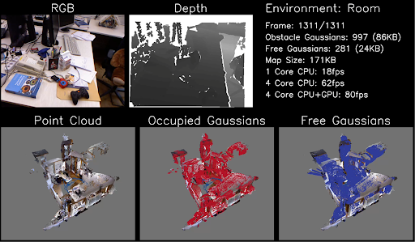

# GMMap: Memory-Efficient Continuous Occupancy Map Using Gaussian Mixture Model #

To appear in IEEE Transactions on Robotics (T-RO)

## Overview
Energy consumption of memory accesses dominates the compute energy in energy-constrained robots which require a compact 3D map of the environment to achieve autonomy. Recent mapping frameworks only focused on reducing the map size while incurring significant memory usage during map construction due to multi-pass processing of each depth image. In this work, we present a memory-efficient continuous occupancy map, named GMMap, that accurately models the 3D environment using a Gaussian Mixture Model (GMM). Memory-efficient GMMap construction is enabled by the single-pass compression of depth images into local GMMs which are directly fused together into a globally-consistent map. By extending Gaussian Mixture Regression to model unexplored regions, occupancy probability is directly computed from Gaussians. Using a low-power ARM Cortex A57 CPU, GMMap can be constructed in real-time at up to 60 images per second. Compared with prior works, GMMap maintains high accuracy while reducing the map size by at least 56%, memory overhead by at least 88%, DRAM access by at least 78%, and energy consumption by at least 69%. Thus, GMMap enables real-time 3D mapping on energy-constrained robots.

You can find the paper [here](https://arxiv.org/pdf/2306.03740.pdf). 

Click on the picture below for our video.

## Code Release Schedule

Currently, the code is under-review by our sponsors and the Technology Transfer Office. We will release the code as soon as possible when the review is completed (early to mid 2024). We cannot wait for to see what applications GMMap can finally enable. Thank you for your understanding!
