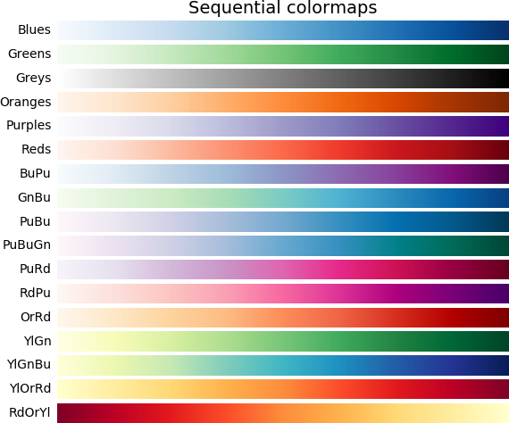
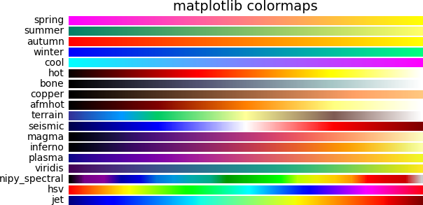
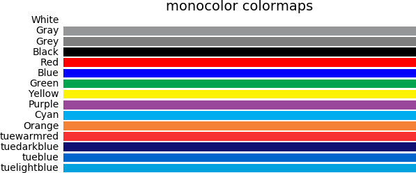
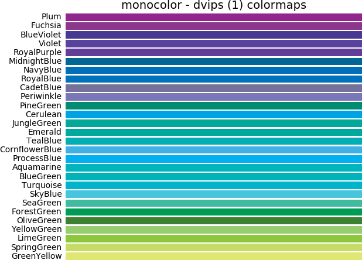
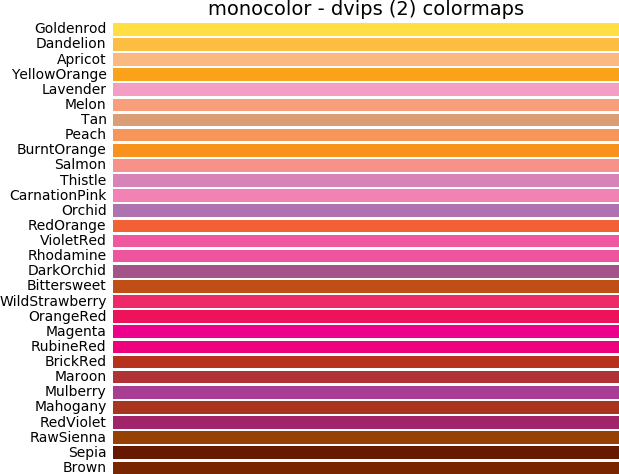
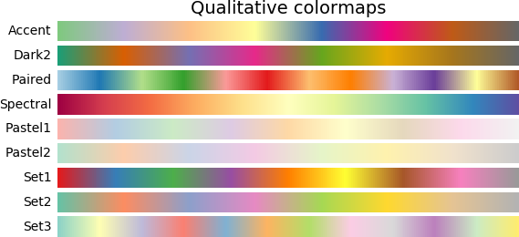

# Eigen-compatible Colormap

Colormaps from Python Matplotlib is ported to C++ via Eigen interface. See original version [here](https://github.com/tdegeus/cppcolormap)

C++ library specifying colormaps.

